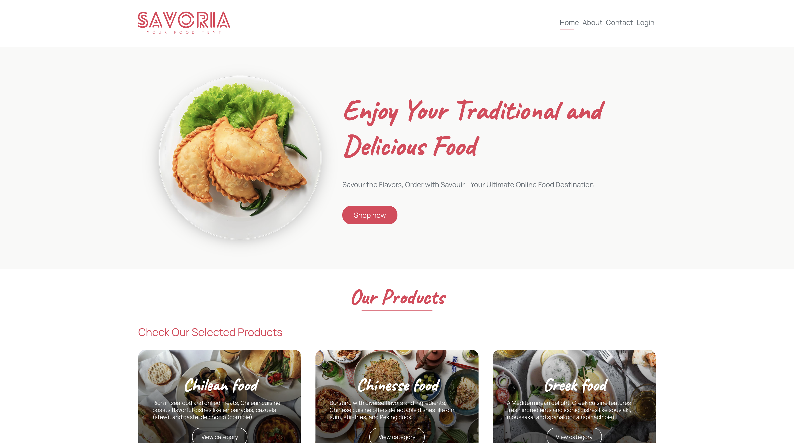

# Savoria E-Commerce

A responsive online store featuring an intuitive product catalog with advanced filtering, a secure checkout process, and an interactive wishlist for an enhanced user experience.

[](https://savoria-ecommerce-2bw9.onrender.com/)


## Screenshot


## Features

- Responsive design for all devices
- Advanced product catalog filtering
- Secure checkout process
- Interactive wishlist
- Modern UI/UX
- Modular folder structure for scalability

## Folder Structure
- **ResponsiveSlides.js-master**: Core slider functionality files
- **css**: Stylesheet files for the project
- **html**: HTML templates and pages
- **img**: Image assets used in the slider and pages
- **js**: JavaScript files and custom scripts
- **json**: JSON configuration files
- **lib**: Library dependencies
- **media**: Additional media resources
- **others**: Miscellaneous files
- **php**: PHP scripts and server-side code
- **sql**: Database queries and schema files


## Getting Started

1. **Clone the repository**
    ```bash
    git clone https://github.com/mazlumunay/savoria-ecommerce.git
    cd savoria-ecommerce
    ```

2. **Set up your web server (Apache, Nginx, etc.)**

3. **Import the database**
    - Use the SQL files in the `sql/` directory to set up your database.

4. **Configure environment**
    - Configure database and environment variables inside the `php/` folder as required.

5. **Run the app**
    - Open `index.php` in your local server environment.

## License

This project is licensed under the MIT License. See the [LICENSE](LICENSE) file for details.

## Contributing

Pull requests are welcome! For major changes, please open an issue first to discuss what you would like to change.

## Author

[mazlumunay](https://github.com/mazlumunay)

---

> Feel free to enhance this `README.md` as the project evolves!